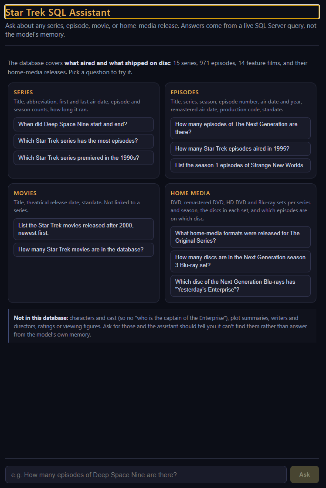

# Star Trek SQL Assistant

Ask plain-English questions about the Star Trek franchise (series, episodes,
movies, home-media releases) and get answers backed by a real SQL Server
query — not the model guessing from memory.



**This is a proof of concept.** It exists to demonstrate one technique — having
a model answer database questions by calling Data API builder's MCP tools
instead of writing SQL — with enough real infrastructure around it that the
idea can be judged honestly. It is built to run on `localhost`, for one person,
on a machine you trust. It is not hardened, it has no authentication, and
several defaults are deliberately open so the moving parts stay visible. Read
[Scope and security](#scope-and-security) before running it anywhere else.

**Stack:** .NET 10 Blazor Web App (Interactive Server) → a tool-calling model →
[Data API builder](https://learn.microsoft.com/en-us/azure/data-api-builder/mcp/overview)'s
SQL MCP Server → SQL Server. The database, DAB, and the web app run in Docker.

**The model is a config switch, not a code change.** `MODEL_PROVIDER` picks
between a local model served by Ollama on your host (the default — free,
private, and GPU-accelerated), OpenAI, or Anthropic. Everything downstream of
that choice talks to .NET's `IChatClient`, so the tools, the tool-calling loop,
and the UI are identical whichever you use. See
[Swapping the model](#swapping-the-model).

The model never writes SQL. It picks from a small set of MCP tools
(`read_records`, `aggregate_records`, `describe_entities`, ...) that DAB
exposes for nine entities — the six tables (`Series`, `Episode`, `Movie`,
`MediaSet`, `MediumVolume`, `MediumVolumeEpisode`) and three pre-joined views
(`EpisodeDetail`, `EpisodeOnDisc`, `SeriesSummary`); DAB's own query builder
turns that tool call into a deterministic, parameterized T-SQL query.

Those views exist because an MCP tool reads **one entity at a time** and
relationships are GraphQL-only, so a question spanning tables otherwise costs a
chain of calls with the model carrying ids between them — which is where a
small model gives up. See [The database](#the-database).

## Prerequisites

- Docker and Docker Compose
- **A model — one of:**
  - *Local (default).* [Ollama](https://ollama.com/download) installed and
    running on the host — **not** in a container. A native install gets GPU
    acceleration; the `ollama/ollama` image would fall back to CPU-only
    inference unless you configure GPU passthrough, and would download its own
    second copy of the model. (If you'd rather containerize it anyway,
    `docs/BuildGuide.md` has the drop-in service definition.) Budget ~8GB free
    RAM to run SQL Server and a local model together comfortably.
  - *Hosted.* An OpenAI or Anthropic API key — no local model, no GPU, and no
    extra RAM. In exchange, your questions and the rows the tools return leave
    your machine.
- (Optional) [.NET 10 SDK](https://dotnet.microsoft.com/download) if you want
  to run the Blazor app outside Docker for faster iteration

## Run it

```bash
cp .env.example .env
# change MSSQL_SA_PASSWORD in .env (the example value is public); pick a model

# first run only, local model: pull a tool-calling-capable one into your Ollama
ollama pull llama3.1
ollama list          # confirm it's there

docker compose up --build -d
```

Then open **http://localhost:8080**.

Going hosted instead? Skip both `ollama` commands, and set `MODEL_PROVIDER`
and the matching API key in `.env` before `docker compose up` — see
[Swapping the model](#swapping-the-model). The rest of the stack is unchanged.

The next two paragraphs apply to the default local setup.

`OLLAMA_MODEL` has to match a tag `ollama list` actually prints, exactly. If
you already have `llama3.1:8b` but not a bare `llama3.1`, either set
`OLLAMA_MODEL=llama3.1:8b` in `.env` or run `ollama pull llama3.1` — the two
are different tags as far as the API is concerned.

The app reaches your host's Ollama at `http://host.docker.internal:11434` —
`host.docker.internal` is the hostname Docker gives containers for the
machine they're running on. Nothing else is needed as long as Ollama is
listening on its default port.

The first `docker compose up` takes a few minutes: SQL Server has to start,
`sql-init` creates the `StarTrek` database and loads the schema/data, then DAB
and the Blazor app come up. If your first question gets "I can't reach the
database connector yet," DAB likely just wasn't fully warmed up — ask again a
few seconds later. `curl http://localhost:8080/health` reports the app's
connection to DAB directly, so you can tell "still starting" from "actually
broken" without going through the chat box.

Restarting DAB under a running app is fine: the app notices the dropped
connection on the next tool call, reconnects and answers anyway. You can watch
that happen. `/health` returns JSON, and the number to watch is `generation` —
how many times the MCP connection has been built since the app started:

```console
$ curl -s localhost:8080/health
{"status":"Healthy","checks":{"dab-mcp":{"status":"Healthy",
 "description":"Connected to the DAB MCP server; 7 tools available.",
 "data":{"endpoint":"http://dab:5000/mcp","generation":1,"tools":7}}}}

$ docker compose restart dab        # ...then ask another question in the UI

$ curl -s localhost:8080/health     # generation is now 2
```

That endpoint reports JSON because of a bug this project had and fixed: the
health check was collecting the endpoint, the tool count and the generation
into its `data` dictionary, but ASP.NET's **default health response writer
emits only the overall status** and silently discards everything else. `curl`
returned the single word `Healthy`, so the one number that proves the reconnect
worked was computed on every request and thrown away — leaving `grep` over the
app log as the only way to see it. `Services/HealthResponse.cs` is a response
writer that serialises the data too, and deliberately never serialises the
exception: the description already carries its message, and `/health` is
pollable by anything that can reach the app.

One thing it will not tell you: whether DAB is up *right now*. The check reads
the connection state the app already has and never dials DAB, because a probe
that opened a connection would hang for the connect timeout at exactly the
moment DAB is down — which is the moment a probe has to answer fast. So a
stopped DAB still reads `Healthy` until something actually tries to use the
connection. It answers "what happened the last time this app talked to DAB",
not "is DAB alive".

### Watching it work

`docker compose up` also starts an [Aspire
Dashboard](https://learn.microsoft.com/dotnet/aspire/fundamentals/dashboard/standalone)
at **http://localhost:18888**, which is where the app's traces, metrics and logs
go. One question is one trace: the browser request, the model round trips (with
the model name and token counts), and a span per database tool the model called —
so "why was that answer wrong" and "why did that take 90 seconds" are questions
you can answer by looking rather than by reading log files.

The metrics worth knowing about are `startrek.questions` and
`startrek.tool.calls`. Both are tagged with an outcome, which matters here
because every failure in this app comes back as a polite sentence in the chat:
without the tag, a stack that is answering nothing looks exactly like one that is
answering everything. `startrek.tool.calls` is also tagged with the tool name,
which is the quickest way to see whether the model is picking sensible tools.

**While a question is still running**, the trace isn't there yet — OpenTelemetry
exports a span when it *ends*, so a model that thinks for four minutes shows up
in Traces four minutes later, all at once. Two things cover that gap: the app
logs `Question received (N characters); asking <backend>` the moment you hit Ask
(Structured Logs tab), and `startrek.questions.active` reads `1` for as long as
the answer is in flight (Metrics tab). Metrics export every 5s here —
`OTEL_METRIC_EXPORT_INTERVAL` in `docker-compose.yml`, because the SDK default of
60s is too coarse to watch anything.

Prompts and model responses are **not** recorded by default. Set
`TELEMETRY_CAPTURE_CONTENT=true` in `.env` and `docker compose up -d` while
you're debugging a bad answer — it's the only way to see what the model was
actually told — then turn it back off.

Running the app on the host (`dotnet run`) exports nothing: `Telemetry:OtlpEndpoint`
is empty in `appsettings.json`, and an exporter pointed at a collector that isn't
there just fills the console with retries. Set
`Telemetry__OtlpEndpoint=http://localhost:18889` if you want that mode to report
into the dashboard too.

## Scope and security

Everything here is tuned for a demo you run on your own machine and shut down
afterwards. Each item below is a deliberate choice that keeps the moving parts
easy to inspect — and each one is a reason not to expose this stack:

- **DAB runs in development mode.** `runtime.host.mode: development` in
  `dab/dab-config.json` is what serves the Nitro GraphQL IDE at
  <http://localhost:5000/graphql/> and opens `/health`. It also returns verbose
  error detail. Production mode still serves the REST and GraphQL APIs — it
  just stops advertising the internals.
- **CORS is wide open.** `cors.origins: ["*"]` in the same file: any origin can
  call those endpoints.
- **DAB connects to SQL Server as `sa`.** The entities only ever need
  `anonymous`/`read`, so a dedicated read-only login is the right call for
  anything longer-lived than a demo.
- **There is no authentication anywhere.** Every DAB entity is
  `anonymous`/`read`, and the chat app has no login. With `MODEL_PROVIDER` set
  to OpenAI or Anthropic, anyone who can reach port 8080 is spending your API
  credits — though no faster than the rate limit below allows.
- **Questions are rate limited, tightly, to protect the local GPU.** At most 5
  questions a minute and 1 at a time, across every visitor combined. A local
  model answers roughly one question at a time and parallel questions only slow
  each other down, so these limits keep the GPU usable; with a hosted provider
  they cap spend instead. A question over either limit gets a chat reply saying
  so and never reaches the model. Tune them in the `RateLimit` section of
  `appsettings.json` — but raising `ConcurrentQuestions` past what your GPU can
  run in parallel defeats the point. The limit is app-wide rather than per
  visitor, which also means one person can use the whole budget.
- **The Aspire Dashboard has its login turned off.**
  `DASHBOARD__FRONTEND__AUTHMODE: Unsecured` in `docker-compose.yml` drops the
  token prompt so the link above just works. The dashboard shows every request
  the app served and, if `TELEMETRY_CAPTURE_CONTENT` is on, everything anyone
  typed into the chat — so leave port 18888 on your own machine.
- **All ports publish on every interface** — SQL Server (1433), DAB (5000),
  the app (8080), and the dashboard (18888/18889) are reachable from your whole
  network, not only the machine running them. Prefix the host side with
  `127.0.0.1:` in `docker-compose.yml` if that network isn't one you trust.
- **The example SA password is public.** Compose refuses to start without a
  `.env` (there is no built-in default), but `.env.example` carries a
  placeholder password that anyone can read in this repo, and compose can't
  tell whether you changed it. Change it after copying, as [Run it](#run-it)
  says.

What is *not* a hole: the model never composes SQL. It picks an MCP tool and
DAB's query builder emits a parameterized query, so a question — however
phrased — can't reach the database as SQL text. DAB advertises
`create_record`/`update_record`/`delete_record` in its tool list regardless of
permissions, but the `anonymous`/`read` role is enforced at execution and a
write returns `PermissionDenied`.

If you want to build on this, the shortest path to something defensible: set
`mode` to `production` (check for an `authentication.provider: Simulator` block
at the same time — it's development-only, and the pair fails at startup),
narrow `cors.origins`, swap `sa` for a read-only SQL login, bind the published
ports to `127.0.0.1`, and put the app behind whatever auth you already run.

## What's in here

```
docker-compose.yml          5 services: sqlserver, sql-init, dab, blazor-app,
                            aspire-dashboard (traces/metrics at :18888)
.env.example                SA password + model provider/keys, copy to .env
db-init/init.sql            Creates the StarTrek DB, schema, and data (runs once)
dab/dab-config.json         DAB entity config — this is what generates the MCP tools
src/StarTrekSqlAssistant.Web/
  Program.cs                 DI wiring: Blazor + the agent service
  Services/ChatClientFactory.cs      Ollama / OpenAI / Anthropic -> IChatClient
  Services/AgentOptions.cs           Config sections for each provider
  Services/StarTrekAgentService.cs   The agent: prompt + tools -> answer
  Services/DabMcpToolProvider.cs     MCP client; the tool list the model sees
  Services/ReconnectingMcpTool.cs    Rebuilds the connection when DAB restarts
  Services/DabMcpHealthCheck.cs      /health — is the MCP connection up?
  Services/AgentTelemetry.cs         Spans and metrics: question outcomes, tool calls
  Services/McpWarmupService.cs       Validates config at startup, connects in the background
  Services/StarTrekPrompt.cs         The system prompt — the only schema the model gets
  Components/Pages/Home.razor        The chat UI
  Dockerfile
tests/StarTrekSqlAssistant.Tests/   Fakes for the model and for DAB; no Docker needed
.github/workflows/ci.yml            Build, test, and build the app image
```

## Tests

```bash
dotnet test StarTrekSqlMPC-POC.slnx
```

Everything the agent depends on is injected behind an interface —
`IChatClientFactory` for the provider, `IMcpToolProvider` for the tools,
`IStarTrekAgent` for the UI — so the whole suite runs in process with no
container, no API key and no model.

The interesting ones are in `ToolCallingTests`: a scripted model, the app's own
`UseFunctionInvocation()` loop, and a fake DAB that enforces the rules the
system prompt asserts. A date filter has to be a full unquoted UTC timestamp;
`aggregate_records` takes one existing column and never an expression;
`describe_entities` comes back with no fields. A rejected argument arrives as a
tool result rather than an exception, so the loop keeps going and the next call
can get it right — and `MaxToolRounds` is what stops it going forever.
`SystemPromptTests` parses `dab/dab-config.json` and `db-init/init.sql` and
fails if the prompt has drifted from either.

## The database

`db-init/init.sql` is a SQL Server (T-SQL) port of the SQLite database at
[chungy/startrek-db](https://github.com/chungy/startrek-db) — six tables
(`series`, `episode`, `movie`, `media_set`, `medium_volume`,
`medium_volume_episode`) covering every Star Trek series and episode, all
fourteen films, and their DVD/Blu-ray/HD DVD releases, plus the original
per-series convenience views (`tng`, `ds9`, `voy`, ...). All credit for
compiling the underlying data goes to that project; this port only changes
the SQL dialect (data types, joins, reserved-word column names) to run on SQL
Server instead of SQLite.

Three things in `init.sql` are **not** from upstream, and they exist for the
model rather than for the data: the `episode_detail`, `episode_on_disc` and
`series_summary` views, plus a `series.abbreviation` column (TOS, TNG, DS9,
...). DAB exposes the three views as entities alongside the tables. Each one
collapses a chain of tool calls into a single call — `series_summary`
precomputes per-series episode and season counts, which `aggregate_records`
cannot produce on its own because it takes one column with no grouping, so
"which series has the most episodes?" has nowhere else to come from. The
tables stay exposed; the system prompt routes to the views and falls back to
the tables for anything they don't cover.

## Swapping the model

The app talks to its model through `IChatClient`, so the backend is a config
switch — `MODEL_PROVIDER` in `.env` (`Ollama`, `OpenAI`, or `Anthropic`), or
`Model__Provider` if you're running outside Docker. Only the selected
provider's settings are read.

**Local (default).** Any Ollama model that supports tool calling works —
`ollama pull <model>` on the host, set `OLLAMA_MODEL` in `.env`, then
`docker compose up -d` to recreate `blazor-app` with the new value.

**Hosted.** Set the provider and its key:

```bash
MODEL_PROVIDER=Anthropic
ANTHROPIC_API_KEY=sk-ant-...
ANTHROPIC_MODEL=claude-haiku-4-5     # or claude-sonnet-5, claude-opus-5
```

```bash
MODEL_PROVIDER=OpenAI
OPENAI_API_KEY=sk-...
OPENAI_MODEL=gpt-4o-mini
```

Running the app on the host instead of in Docker, the keys go in user-secrets
rather than `.env`:

```bash
dotnet user-secrets set "Anthropic:ApiKey" "sk-ant-..."   --project src/StarTrekSqlAssistant.Web
```

A hosted provider with no key fails at startup with a message naming the
setting, rather than breaking on the first question. Either way, the tool
list, the tool-calling loop, and the UI are unchanged — only
`Services/ChatClientFactory.cs` knows a vendor exists.

Model choice matters more than it looks. Small local models tend to guess
column names rather than look them up, and answer "the database doesn't have
that field" when they guess wrong; check `docker compose logs -f blazor-app`
to see which tool actually got called before blaming the data.

## Ideas for extending this

- **Generate the schema half of the system prompt instead of writing it.**
  Right now the column lists in `Services/StarTrekPrompt.cs` are typed by hand
  and kept honest by `SystemPromptTests`, which fails the build if they drift
  from `dab-config.json` or `init.sql`. That works, but the database already
  knows its own columns, so a human shouldn't be retyping them.

  The obvious fix — move the columns into the DAB entity `description` fields —
  is the wrong one, for two measured reasons. DAB's MCP `describe_entities`
  returns `"fields": []` for every entity (still true in 2.0.9), so the model
  cannot read a schema from the tool surface at all; and an entity description
  only reaches the model *through* `describe_entities`, never in `tools/list`.
  The model would have to spend a tool round trip, every question, to learn
  what the system prompt gives it for free before it does anything — against a
  `MaxToolRounds` budget of 6 and a 5-questions-a-minute cap.

  The route that works is `GET /api/openapi`. DAB serves the full REST schema
  there — every entity, every column, its type, and the entity description —
  including the views:

  ```
  Series        -> series_id, title, abbreviation, begin, end
  SeriesSummary -> ... episode_count, season_count, run_days, first_airdate ...
  ```

  So the schema section of the prompt could be composed at startup from that
  document, leaving only the hand-written half: the tool-behaviour rules
  (`aggregate_records` takes one column and no expressions, date filters need
  bare UTC timestamps, titles use the curly `’`, route cross-table questions to
  the views). None of those are derivable from a schema.

  That endpoint survives `runtime.host.mode: production` — verified; only the
  GraphQL IDE 404s there — so this isn't a trick that works only in the demo
  configuration.

  Not done here because it trades a tested three-file edit for a startup
  dependency on DAB plus a fallback for the first question asked before DAB is
  warm, and the schema has changed twice in the life of the project.
- Expose the remaining per-series views (`tng`, `voy`, `ds9`, ...) as DAB
  entities too — the three purpose-built views already exposed
  (`EpisodeDetail`, `EpisodeOnDisc`, `SeriesSummary`) show the shape
- Add a "manager" GraphQL/REST role with its own permissions instead of the
  demo's single `anonymous` read-only role
- Point `OPENAI_ENDPOINT` at Azure OpenAI or any OpenAI-compatible gateway —
  the OpenAI provider already accepts a custom base URL
- Add another provider: one `switch` case in `Services/ChatClientFactory.cs`
  and an options class in `AgentOptions.cs`, nothing else

## License

The code in this repository is released under the [MIT License](LICENSE).

The Star Trek data in `db-init/init.sql` is ported from
[chungy/startrek-db](https://github.com/chungy/startrek-db), which is dedicated
to the public domain under
[CC0 1.0](https://creativecommons.org/publicdomain/zero/1.0/). Star Trek and
related marks are trademarks of CBS Studios Inc.; this project is not
affiliated with or endorsed by them.
