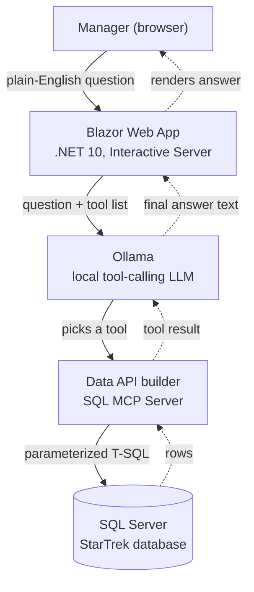

# Star Trek SQL Assistant — How It Works, and How to Rebuild It

This document explains every piece of technology in this project, why it's
there, and the exact steps to build the whole thing from an empty folder. It
also catalogs the real errors hit while building this the first time, since
the same tooling gotchas will happen again on a fresh setup.

---

## 1. What this project is

A Blazor web app where you type a plain-English question about Star Trek —
*"how many episodes of Deep Space Nine are there?"* — and get back an answer
generated from a live SQL Server query, not from the model's memory of Star
Trek trivia.

**Stack:** .NET 10 Blazor Web App → local Ollama model → Data API builder's
SQL MCP Server → SQL Server. Four of those five pieces run as Docker
containers; Ollama runs natively on the host, for reasons covered in Part 3.

## 2. The one idea the whole thing is built around

The obvious way to build "ask a database questions in English" is to have an
LLM write SQL directly. That's risky: model output isn't deterministic, and
it's precisely the complex, valuable queries that are riskiest to generate
that way — a wrong `JOIN` or a dropped `WHERE` clause can return confidently
wrong numbers with no indication anything went wrong.

[Data API builder (DAB)](https://learn.microsoft.com/en-us/azure/data-api-builder/mcp/overview)
takes a different approach with its **SQL MCP Server** feature. Instead of
letting a model write SQL, DAB exposes a small, fixed set of tools —
`read_records`, `aggregate_records`, `describe_entities`, and a few others —
over the [Model Context Protocol](https://modelcontextprotocol.io). The model
picks a tool and structured arguments (*"aggregate `Episode`, filter
`series_id = 2`, count rows"*); DAB's own query builder is what actually
generates the T-SQL, the same well-formed statement every time for the same
call. The model never touches SQL. It can only invoke the operations you've
explicitly configured, on the entities you've explicitly exposed.

This is what makes it safe to point a chat UI at a real database.



The boxes map directly onto the runtime pieces: `blazor-app` is box B, the
host's Ollama install is box C, `dab` is box D, `sqlserver` is box E. Only C
lives outside Docker. `sql-init` is a fifth, one-shot container that only
exists to load data into E before anything else starts — it doesn't appear in
the diagram because it's not part of the running system, just its setup.

---

## 3. Prerequisites

- Docker Desktop (with Compose — bundled by default)
- [Ollama](https://ollama.com/download) installed natively on the host, with a
  tool-calling model pulled (`ollama pull llama3.1`)
- ~8GB free RAM to comfortably run SQL Server + Ollama + a model side by side
- (Optional) [.NET 10 SDK](https://dotnet.microsoft.com/download) if you want
  to run the Blazor app outside Docker while developing it

---

## 4. Part 1 — The database

### Where the data comes from

The schema and data are ported from
[chungy/startrek-db](https://github.com/chungy/startrek-db), a small SQLite
database covering every Star Trek series, episode, and film. Six tables:

| Table | What it holds |
|---|---|
| `series` | One row per TV series, with first/last air date |
| `episode` | Every episode, linked to `series` via `series_id` |
| `movie` | The films (not linked to a series) |
| `media_set` | A DVD/Blu-ray/HD DVD release for one series + season |
| `medium_volume` | A single disc within a `media_set` |
| `medium_volume_episode` | Which episodes are on which disc |

### Why it needed porting, not just copying

SQLite and T-SQL (SQL Server's dialect) disagree on enough syntax that the
original `schema.sql`/`data.sql` won't run as-is:

- **Types.** SQLite's `TEXT`/`INTEGER`/`BOOLEAN` become `NVARCHAR(n)` / `INT`
  / `BIT` — and `BIT` means the *data* has to become `1`/`0` too, since T-SQL
  has no `True`/`False` literals. `DATETIME` becomes `DATETIME2(0)`, with one
  exception: `episode.[date]` stays `NVARCHAR`, because those are in-universe
  dates and a handful are month-precision only (`'2256-11'`).
- **Primary keys.** SQLite's `INTEGER PRIMARY KEY` auto-increments
  implicitly. Since every table's data script supplies explicit ID values
  anyway, most tables just use a plain `INT NOT NULL PRIMARY KEY` — no
  `IDENTITY` needed. The one exception is `medium_volume_episode`, whose
  insert statements *don't* supply an ID, so that one table needs
  `IDENTITY(1,1)`.
- **Foreign keys.** SQLite infers the referenced column from the target's
  primary key; T-SQL requires it explicitly: `REFERENCES dbo.series` becomes
  `REFERENCES dbo.series(series_id)`.
- **Reserved words.** The `series` table has columns literally named `begin`
  and `end` — both T-SQL keywords. They're bracketed everywhere they appear:
  `[begin]`, `[end]`.
- **Joins.** SQLite's `JOIN table USING (col)` shorthand doesn't exist in
  T-SQL; every one became an explicit `JOIN table ON a.col = b.col`.
- **Unicode.** Episode titles use real Unicode punctuation (curly
  apostrophes, en-dashes) rather than plain ASCII. Without an `N` prefix on
  string literals, SQL Server can silently mangle those characters when
  converting to `NVARCHAR`. Every string literal in the data script is
  `N'...'`, not `'...'`.

Here's the actual `episode` table, showing several of these at once:

```sql
CREATE TABLE dbo.episode (
    episode_id           INT            NOT NULL PRIMARY KEY,
    series_id            INT            NOT NULL REFERENCES dbo.series(series_id),
    title                NVARCHAR(200)  NOT NULL,
    airdate              DATE           NULL,
    remastered_airdate   DATE           NULL,
    season               INT            NULL,
    episode_number       INT            NULL,
    production_code      NVARCHAR(20)   NULL,
    stardate             NVARCHAR(20)   NULL,
    [date]               NVARCHAR(20)   NULL,
    vignette             BIT            NULL
);
```

The original SQLite source also ships ~24 convenience views, one per series
(`tng`, `ds9`, `voy`, ...). Those were ported too — mechanically the same
work, plus rewriting each view's joins. One honest simplification: a few of
the original views ordered results with `ORDER BY ... NULLS LAST`, which
T-SQL has no equivalent for. Since none of these views are wired into DAB (only
the six base tables are — see Part 2), the ordering was dropped rather than
reimplemented with an explicit `CASE WHEN ... IS NULL THEN 1 ELSE 0 END`
expression. If you start querying these views directly, that's where to add
it back.

```sql
CREATE VIEW dbo.tng AS
  SELECT episode_id, title, airdate, season, episode_number, production_code, stardate
    FROM dbo.episode
   WHERE series_id = (SELECT series_id FROM dbo.series WHERE title = N'Star Trek: The Next Generation');
GO
```

### The actual file

All of this — six `CREATE TABLE` statements, ~24 `CREATE VIEW` statements,
and every row of data — lives in **`db-init/init.sql`**, wrapped in a
preamble that creates the `StarTrek` database if it doesn't already exist:

```sql
IF DB_ID(N'StarTrek') IS NULL
BEGIN
    CREATE DATABASE StarTrek;
END
GO

USE StarTrek;
GO
```

Every `DROP TABLE`/`DROP VIEW` in the file is guarded with
`IF OBJECT_ID(...) IS NOT NULL`, which makes the whole script safe to re-run:
it'll drop and recreate everything cleanly rather than erroring on a second
run.

---

## 5. Part 2 — Data API builder configuration

`dab/dab-config.json` is the entire "backend" of this app in one file — no
custom API code, just configuration.

```json
{
  "data-source": {
    "database-type": "mssql",
    "connection-string": "@env('DATABASE_CONNECTION_STRING')"
  },
  "runtime": {
    "mcp": {
      "enabled": true,
      "description": "Query a reference database covering the Star Trek franchise: ..."
    }
  },
  "entities": {
    "Episode": {
      "source": { "object": "dbo.episode", "type": "table" },
      "description": "Individual episodes across every Star Trek series. series_id links to Series. ...",
      "permissions": [
        { "role": "anonymous", "actions": ["read"] }
      ]
    }
  }
}
```

Three things worth understanding about this file:

- **The `description` fields aren't decoration.** They're what the model
  reads to decide which entity answers a given question, and what a
  column means. Vague descriptions produce a model that picks the wrong
  table or misreads a filter.
- **`permissions` is real access control, not a suggestion.** Every entity
  here only grants `"read"` to the `anonymous` role. Even if a model
  hallucinated a request to call `create_record` or `delete_record`, DAB
  would reject it — this isn't just a prompting convention, it's enforced
  server-side regardless of what the model asks for.
- **Relationships were left out on purpose.** DAB supports declaring
  formal entity relationships (for nested GraphQL queries), using a
  slightly unusual flat-key syntax:
  ```json
  "relationships": {
    "series": {
      "cardinality": "one",
      "target.entity": "Series",
      "source.fields": ["series_id"],
      "target.fields": ["series_id"]
    }
  }
  ```
  This project skips them: the MCP tools can filter on `series_id` directly
  without a declared relationship (e.g., "look up Voyager's `series_id`,
  then filter `Episode` by it" — two tool calls, no relationship needed).
  Add relationships later if you want richer GraphQL nesting.

All six tables (`Series`, `Episode`, `Movie`, `MediaSet`, `MediumVolume`,
`MediumVolumeEpisode`) are configured the same way — read-only, anonymous
role, one paragraph description each. See the full file for all six.

---

## 6. Part 3 — Docker Compose

Four services, defined in `docker-compose.yml`:

| Service | Image | Role |
|---|---|---|
| `sqlserver` | `mcr.microsoft.com/mssql/server:2022-latest` | Hosts the `StarTrek` database |
| `sql-init` | same image, reused | One-shot: loads `init.sql`, then exits |
| `dab` | `mcr.microsoft.com/azure-databases/data-api-builder:latest` | Turns `dab-config.json` into REST/GraphQL/MCP |
| `blazor-app` | built from `src/StarTrekSqlAssistant.Web` | The chat UI + agent |

The model runtime is deliberately *not* one of them — see the next section.

A few decisions here are easy to get wrong, because the "obvious" version
fails in ways that are confusing to debug:

**`sql-init` reuses the SQL Server image, not a separate tools image.**
`sqlcmd` already ships inside `mcr.microsoft.com/mssql/server`, so there's no
need to pull anything extra — just override the entrypoint to run `sqlcmd`
instead of starting a new server:

```yaml
sql-init:
  image: mcr.microsoft.com/mssql/server:2022-latest
  depends_on:
    sqlserver:
      condition: service_healthy
  volumes:
    - ./db-init:/scripts:ro
  entrypoint:
    - /opt/mssql-tools18/bin/sqlcmd
    - -C
    - -S
    - sqlserver
    - -U
    - sa
    - -P
    - "${MSSQL_SA_PASSWORD:-YourStrong!Passw0rd}"
    - -i
    - /scripts/init.sql
  restart: "no"
```

Two details in that block matter more than they look:

- **`/opt/mssql-tools18`, not `/opt/mssql-tools`.** Recent SQL Server images
  renamed the tools folder when they moved to `mssql-tools18`. The old path
  silently doesn't exist in current images.
- **The `-C` flag.** `mssql-tools18` defaults to encrypted connections and
  refuses to proceed unless you either trust or supply a certificate. `-C`
  tells it to trust the server certificate — without it, every `sqlcmd`
  call in this file fails immediately.

**`depends_on: condition: service_completed_successfully`** is what makes
`dab` wait for `sql-init` to actually *finish* (exit code 0), not just start.
Without this, DAB can boot before the database exists.

**The healthcheck uses `$$` deliberately:**

```yaml
healthcheck:
  test: >-
    /opt/mssql-tools18/bin/sqlcmd -C -S localhost -U sa
    -P "$${MSSQL_SA_PASSWORD}" -Q "SELECT 1" -b -o /dev/null
```

`$$` is how you escape a literal `$` in a Compose file. Without the second
`$`, Compose would try to substitute `MSSQL_SA_PASSWORD` itself at
parse-time (before the container even exists) instead of leaving `$VAR` for
the container's own shell to expand at runtime from its own environment.

**One password, one `.env` file, several services.** `MSSQL_SA_PASSWORD` is
read by `sqlserver` (as an env var), `sql-init` (as a literal `-P` argument),
and `dab` (inside the connection string) — all from the same
`${MSSQL_SA_PASSWORD:-YourStrong!Passw0rd}` reference, resolved once by
Compose itself from a `.env` file. Copy `.env.example` to `.env` before
running anything.

### Why Ollama isn't a container here

The obvious fifth service would be `ollama/ollama:latest` with a named volume
for its models. This project doesn't do that, for two reasons:

- **GPU.** A native Ollama install picks up CUDA (or Metal, or ROCm) on its
  own. The container gets nothing unless you also configure device
  passthrough — an NVIDIA Container Toolkit install on the host plus a
  `deploy.resources.reservations.devices` block in the service. Without it,
  inference silently falls back to CPU, which is a large slowdown for a
  tool-calling model that has to produce structured output and then read a
  tool result before it can answer.
- **A second copy of the model.** The container's models live in its own
  volume, so pulling `llama3.1` there downloads several more gigabytes even
  if the identical model is already sitting in your host's Ollama.

The trade-off is honest: the stack is no longer fully self-contained in
Docker. Ollama becomes a host dependency, and someone cloning this repo has
to install it before `docker compose up` will produce a working chat.

So `blazor-app` reaches out to the host instead:

```yaml
blazor-app:
  depends_on:
    - dab
  extra_hosts:
    - "host.docker.internal:host-gateway"
  environment:
    Dab__McpEndpoint: "http://dab:5000/mcp"
    Ollama__Endpoint: "${OLLAMA_ENDPOINT:-http://host.docker.internal:11434}"
    Ollama__Model: "${OLLAMA_MODEL:-llama3.1}"
```

`host.docker.internal` is a hostname Docker Desktop resolves, from inside a
container, to the machine the container is running on — the escape hatch for
talking to something running natively rather than in another container.
`localhost` won't do it: inside a container that means the container itself.
The `extra_hosts` line maps the same name to the host gateway explicitly,
which is what makes this also work on plain Docker Engine on Linux, where the
name isn't provided automatically.

One consequence worth knowing: Ollama must be listening on an address the
container can reach. The default (`127.0.0.1:11434`) is enough on Docker
Desktop, since its network stack proxies `host.docker.internal` to the host's
loopback. On Linux, set `OLLAMA_HOST=0.0.0.0:11434` in Ollama's environment
so it binds an interface the bridge network can actually reach.

### The alternative: putting Ollama back in Docker

On a machine with no native Ollama — a CI runner, a server, someone else's
laptop — add the service back and repoint the endpoint. Add to `services:`:

```yaml
  ollama:
    image: ollama/ollama:latest
    ports:
      - "11434:11434"
    volumes:
      - ollama-data:/root/.ollama
    # For NVIDIA GPU passthrough (needs the NVIDIA Container Toolkit on the
    # host), uncomment:
    # deploy:
    #   resources:
    #     reservations:
    #       devices:
    #         - driver: nvidia
    #           count: all
    #           capabilities: [gpu]
```

add `ollama-data:` back under the top-level `volumes:` key, add `- ollama` to
`blazor-app`'s `depends_on`, and set `OLLAMA_ENDPOINT=http://ollama:11434` in
`.env` — that variable exists precisely so this switch doesn't require editing
the Compose file's environment block. Then pull the model into the container
rather than the host:

```bash
docker compose exec ollama ollama pull llama3.1
```

---

## 7. Part 4 — The Blazor app

### Scaffolding

```bash
dotnet new blazor -o src/StarTrekSqlAssistant.Web --interactivity Server
cd src/StarTrekSqlAssistant.Web
dotnet add package ModelContextProtocol --version 2.2.0
dotnet add package Microsoft.Extensions.AI --version 10.9.0
dotnet add package OllamaSharp --version 5.4.30
```

- **`ModelContextProtocol`** — the MCP client that talks to DAB.
- **`Microsoft.Extensions.AI`** — the `IChatClient` abstraction and, more
  importantly, `ChatClientBuilder().UseFunctionInvocation()`, which is what
  runs the actual tool-calling loop (see below).
- **`OllamaSharp`** — provides `OllamaApiClient`, an `IChatClient`
  implementation that talks to Ollama. (There used to be an official
  `Microsoft.Extensions.AI.Ollama` package; it's deprecated in favor of
  this one.)

### Why "Interactive Server," specifically

Blazor Web Apps can render three ways: Server, WebAssembly, or Auto. This
app needs an LLM API connection and an MCP client alive somewhere — and
neither of those belongs in code that ships to the browser. Interactive
Server keeps all of that on the container; the browser only ever receives
UI updates over a SignalR connection. WebAssembly would need a separate
backend API to hold that logic instead, which is unnecessary complexity here.

### The agent: tying it together

The core logic lives in `Services/StarTrekAgentService.cs`. Stripped to its
shape:

```csharp
// 1. An IChatClient for whichever backend Model:Provider selects, wrapped
//    with automatic tool-calling. ChatClientFactory holds all three cases:
//      Ollama    -> new OllamaApiClient(http, model)
//      OpenAI    -> new OpenAIClient(cred, opts).GetChatClient(model).AsIChatClient()
//      Anthropic -> new AnthropicClient { ApiKey = ... }.AsIChatClient(model, maxTokens)
//    Only this line differs between providers; everything after it is identical.
var chatClient = new ChatClientBuilder(inner)
    .UseFunctionInvocation()
    .Build();

// 2. Connect to DAB over MCP and list its tools.
var transport = new HttpClientTransport(new HttpClientTransportOptions
{
    Endpoint = new Uri(dabMcpEndpoint),
});
var mcpClient = await McpClient.CreateAsync(transport);
var tools = await mcpClient.ListToolsAsync();

// 3. Ask a question. UseFunctionInvocation() handles the entire loop:
//    the model picks a tool, the tool actually gets called, the result
//    goes back to the model, and it drafts the final answer — automatically.
var response = await chatClient.GetResponseAsync(
    messages,
    new ChatOptions { Tools = [.. tools] });

string answer = response.Text;
```

That `UseFunctionInvocation()` call is doing more work than its size
suggests — without it, `GetResponseAsync` would just return "I want to call
`read_records`" as a raw response, and you'd have to detect that, invoke the
tool yourself, and make a second call with the result. With it, all of that
happens inside the one `GetResponseAsync` call.

The real file adds two things this sketch skips: a system prompt describing
the six entities so the model doesn't have to guess the schema, and a
lazy/retry-safe connection (so the app doesn't crash if it starts before DAB
is ready — it just tries again on the next question).

### Rendering the UI

The chat page (`Components/Pages/Home.razor`) keeps a
`List<ChatMessage>` seeded with the system prompt, appends a `User` message
on submit, calls the agent, appends the `Assistant` reply, and re-renders.
Nothing unusual here — it's a standard Blazor `@code` block with `@bind` on
an `<input>` and `@onsubmit` on a `<form>`.

**One gotcha worth flagging explicitly**, because it produced a real build
error while making this: the standard Blazor template writes
`@rendermode="InteractiveServer"` as a bare name, which only resolves
because of a `@using static Microsoft.AspNetCore.Components.Web.RenderMode`
directive that's easy to leave out of a hand-written `_Imports.razor`. If
you see:

```text
error CS0103: The name 'InteractiveServer' does not exist in the current context
```

either add that `@using static` line, or just qualify it explicitly, which
is what this project does:

```razor
<Routes @rendermode="RenderMode.InteractiveServer" />
```

---

## 8. Building it from scratch, in order

If you're starting from an empty folder rather than this delivered project,
here's the order that avoids backtracking:

1. **Get the source data.** Clone
   [chungy/startrek-db](https://github.com/chungy/startrek-db) to see the
   original `schema.sql`/`data.sql` (or just use this project's already-ported
   `db-init/init.sql` directly).
2. **Write `db-init/init.sql`** — the create-database preamble, six tables,
   the views, then the data. (Section 4.)
3. **Write `dab/dab-config.json`** — one entity block per table, all
   `anonymous`/`read`. (Section 5.)
4. **Scaffold the Blazor project** with `dotnet new blazor` and add the
   three NuGet packages. (Section 7.)
5. **Write `Services/StarTrekAgentService.cs`, `Program.cs`, and
   `Components/Pages/Home.razor`.**
6. **Write the `Dockerfile`** (multi-stage: SDK image to publish, ASP.NET
   image to run) **and a `.dockerignore`** — see the callout below, this one
   is important enough to build in from the start rather than discovering it
   the hard way.
7. **Write `docker-compose.yml`** wiring the four services together, with
   `blazor-app` pointed at the host's Ollama. (Section 6.)
8. **Copy `.env.example` to `.env`.**
9. **Pull a tool-calling model into your native Ollama** and confirm it's
   visible:
   ```bash
   ollama pull llama3.1
   ollama list
   ```
10. **Run it:**
    ```bash
    docker compose up --build -d
    ```
11. Open **<http://localhost:8080**.>

> **Don't skip the `.dockerignore`.** If you build this project on Windows
> after ever running `dotnet build` or opening it in Visual Studio locally,
> your `bin/` and `obj/` folders will contain NuGet cache files with
> Windows-specific paths baked in. Docker's `COPY . .` step will happily
> copy those into the image, overwriting the container's own correct
> Linux-native restore output — producing a build failure that looks like a
> packaging bug but is actually just stale local files leaking into the
> image. A `.dockerignore` with `bin/`, `obj/`, `**/bin/`, `**/obj/` prevents
> this entirely, and it's worth adding *before* your first `docker build`,
> not after your first confusing error.

---

## 9. Troubleshooting reference

Real errors hit while building this, in case they recur:

| Symptom | Cause | Fix |
|---|---|---|
| `NuGet.Packaging.Core.PackagingException: Unable to find fallback package folder 'C:\Program Files (x86)\...'` | Local Windows `bin`/`obj` copied into the image via `COPY . .`, overwriting the container's Linux restore | Add `.dockerignore` excluding `bin/`, `obj/` (see above) |
| `error CS0103: The name 'InteractiveServer' does not exist in the current context` | Bare `InteractiveServer` needs a `@using static` this project doesn't have | Use `RenderMode.InteractiveServer` instead |
| `ports are not available: ... 0.0.0.0:1433 ...` | Local SQL Server Express / LocalDB already using that port | Change the **host-side** number in that service's `ports:` mapping, e.g. `"1434:1433"` — leave the container-side number alone |
| `ports are not available: ... 0.0.0.0:11434 ...` | Only applies if you added the containerized Ollama back while a native Ollama is running | Drop the container's `ports:` mapping (nothing outside Docker needs it), or remap the host side to `"11435:11434"` |
| Chat fails with a connection refused / no route to `host.docker.internal:11434` | The host's Ollama isn't running, or isn't listening on an interface the container can reach | `ollama list` on the host to confirm it's up; on Linux also set `OLLAMA_HOST=0.0.0.0:11434` for the Ollama service |
| Chat fails with a 404 from Ollama, or "model not found" | `OLLAMA_MODEL` names a model the **host's** Ollama hasn't pulled | `ollama pull <model>` on the host — pulling into a container's volume doesn't count now that the app talks to the native install |
| Chat replies with "I can't reach the database connector yet" | DAB isn't reachable yet, or never started | Check `docker compose ps` (is `dab` `Up`? did `sql-init` `Exit(0)`?), then `docker compose logs dab` |
| `docker compose ps` prints only headers, no rows | Run from a different folder than the one with `docker-compose.yml` | `cd` into the project folder first, or use `docker ps -a` which isn't folder-scoped |
| SQL Server container won't become healthy / exits immediately | `MSSQL_SA_PASSWORD` doesn't meet complexity rules | Use 8+ characters spanning upper, lower, digit, and symbol |
| SQL Server never becomes healthy, healthcheck log says `Health check exceeded timeout` | The probe used `-S localhost`. Inside the container that resolves to `::1` first, and ODBC Driver 18 fails there instead of falling back to IPv4 | Probe `-S 127.0.0.1`. No timeout increase helps — the `localhost` form never connects at all |
| `dab` exits 255 with `Unable to launch the runtime due to: ... Authentication configuration not supported` | `runtime.host.authentication.provider: Simulator` is only valid when `runtime.host.mode` is `development` | Either set `mode: development`, or drop the `authentication` block entirely — every entity here is `anonymous`/`read`, so no provider is needed |
| `sql-init` exits **0** but every table is empty | `sqlcmd` without `-b` returns success even when the script raised errors | Add `-b` to the `sql-init` entrypoint, then read `docker compose logs sql-init` for the real error |
| `Invalid column name 'False'` during the data load | SQLite `True`/`False` literals survived the port; T-SQL `BIT` takes `1`/`0`, and a bare `True` parses as a column reference | Replace with `1`/`0`. Note the whole data section is a single batch (no `GO`), so this one compile error rolls back *every* insert — that's why the symptom is an entirely empty database, not one bad column |
| `Conversion failed when converting date and/or time from character string` | `episode.[date]` was ported to `DATETIME2(0)`, but a few in-universe dates are month-precision (`'2256-11'`) and no SQL date type accepts them | Keep that column `NVARCHAR` — it's `TEXT` in the SQLite source for exactly this reason |
| `Error converting data type nvarchar to numeric` on an `INSERT` | One multi-row `VALUES` column mixed bare numerics with a quoted non-numeric string (`stardate` `1739.12` alongside `N'2291.6, 58460.1'`). Type precedence resolves the column to numeric and the string row fails | Quote every value in that column so it resolves as `nvarchar` |

---

## 10. Extending this

- Expose the per-series views (`tng`, `voy`, `ds9`, ...) as their own DAB
  entities for narrower, purpose-built tools instead of always filtering
  `Episode` by `series_id`.
- Add the `relationships` blocks described in Part 2 for richer GraphQL
  queries.
- Swap Ollama for Azure OpenAI, OpenAI, or Anthropic — only the constructor
  of `StarTrekAgentService` changes, since everything downstream talks to
  the shared `IChatClient` abstraction.
- Add a real authenticated role instead of the demo's single
  `anonymous`/`read` permission.
