# What happens when a user asks a question

A step-by-step trace of one question, from the keypress in the browser to the
answer bubble, with every hop named after the code that performs it.

The example throughout is **"How many episodes of DS9 are there?"**. The tool
call shown for it is illustrative — the model chooses the tool and its
arguments, so a different model may take a different route to the same answer.

- [1. The whole trip, at a glance](#1-the-whole-trip-at-a-glance)
- [2. The trip, phase by phase](#2-the-trip-phase-by-phase)
- [3. Every way `AskAsync` can end](#3-every-way-askasync-can-end)
- [4. One tool call when the connection has died](#4-one-tool-call-when-the-connection-has-died)
- [5. What actually crosses each wire](#5-what-actually-crosses-each-wire)

The diagrams are deliberately narrow — a few participants each — so they
render at full size instead of being shrunk to fit the page.

---

## 1. The whole trip, at a glance

Each box is one phase, drawn in detail in the next section. The step numbers
run 1–48 across all of them.

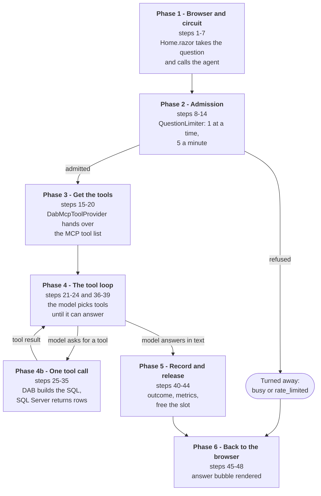

---

## 2. The trip, phase by phase

### Phase 1 — the browser and the circuit (steps 1–7)

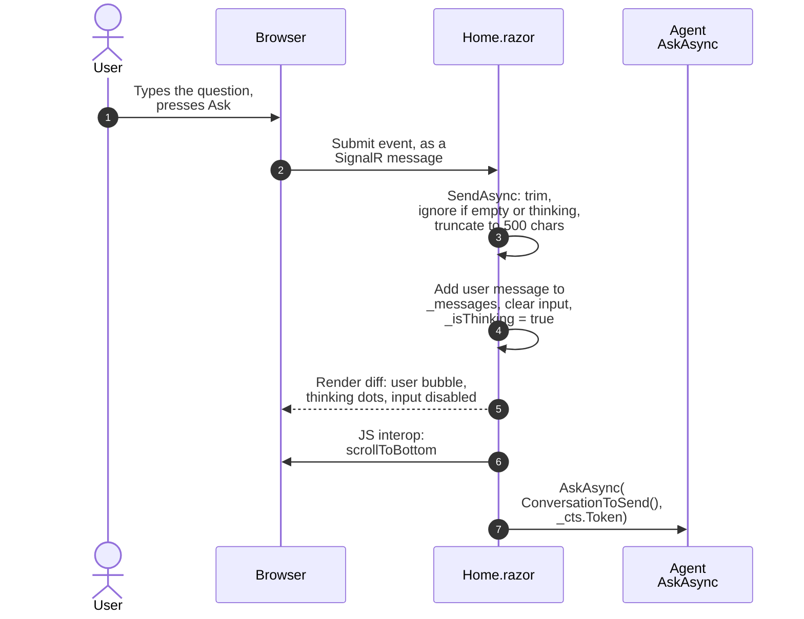

Nothing here is an HTTP request. The page opened a SignalR connection (the
*circuit*) when it loaded, and the submit travels over it as a message; that
is why the question limit lives in `AskAsync` and not in HTTP middleware.

`Home.razor` owns the conversation. `_messages` keeps the full transcript for
display, while `ConversationToSend()` sends the agent only the system prompt
plus the last `MaxHistoryMessages` (10). The system prompt is always element 0
and is never trimmed, because it is the only schema the model ever sees.

The 500-character cap is enforced twice — `maxlength` on the input, and the
truncate in step 3 for anything that reaches the circuit without going through
a browser. Clicking a sample chip enters at step 2 the same way.

### Phase 2 — admission (steps 8–14)

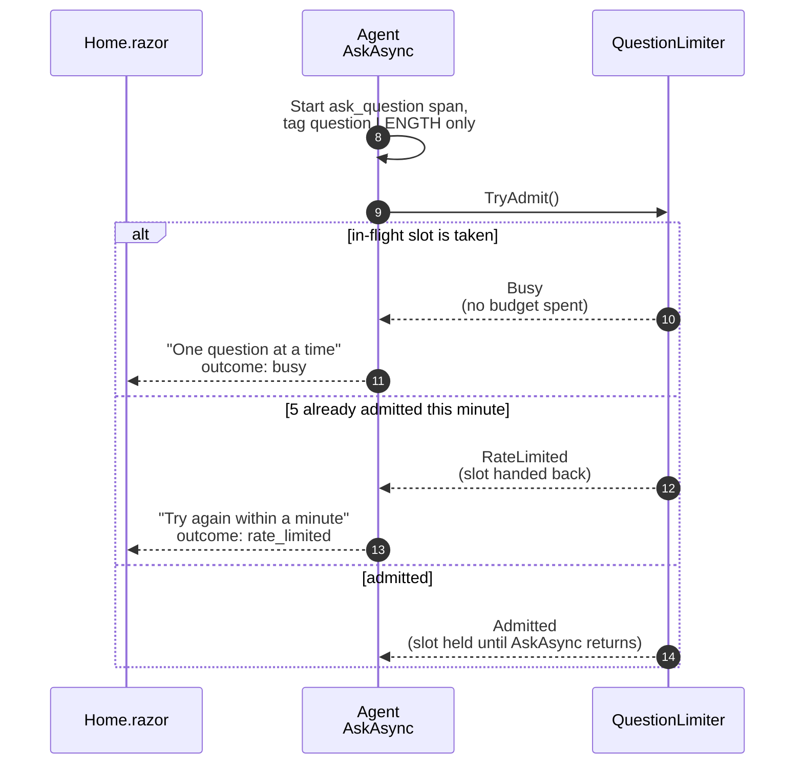

`QuestionLimiter` is a singleton, so both limits are app-wide. The in-flight
slot (1) is checked before the per-minute budget (5), so a question refused as
`busy` costs none of the five. There is no queue: a refused question is
answered immediately with a sentence saying why, and skips straight to phase 6.

A rejection still gets the `ask_question` span and is counted under its own
outcome, but never touches `questions.active`.

### Phase 3 — make the question visible, then get the tools (steps 15–20)

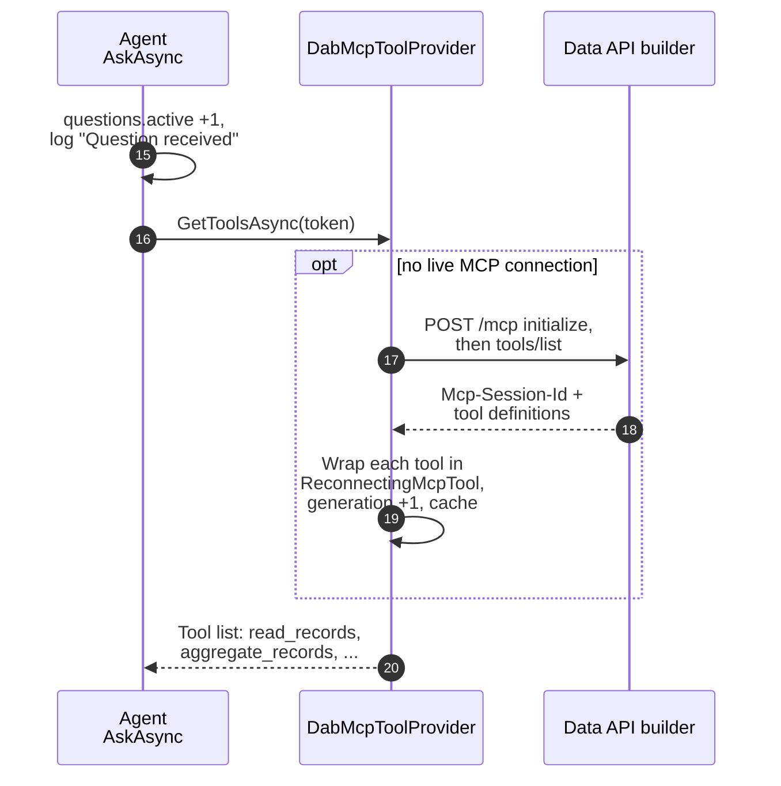

The counter and the log line are written *before* the slow part on purpose: a
span is exported only when it ends, so they are the only evidence a question
is in flight while a local model thinks for minutes. The log carries the
question's length, never its text.

`GetToolsAsync` normally returns a cached list — `McpWarmupService` opened the
connection at startup — so steps 17–19 run only on a cold start or after a
dead connection was discarded. If the connect fails, the user gets "I can't
reach the database connector yet" (outcome `dab_unreachable`).

### Phase 4 — the tool loop (steps 21–24 and 36–39)

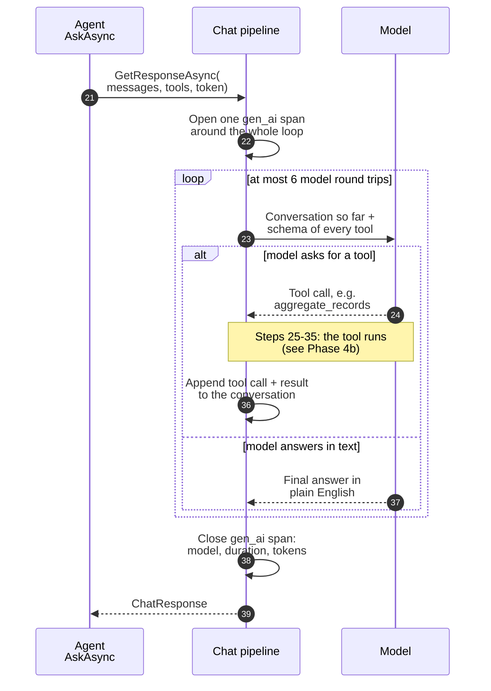

"Chat pipeline" is what `ChatClientFactory.Wrap` builds:
`UseOpenTelemetry → UseFunctionInvocation → provider client`. The model is
Ollama on the host by default, or OpenAI / Anthropic — a config switch.

`FunctionInvokingChatClient` does all the bookkeeping: send, execute the tool
the model asked for, append the result, send again. There is no hand-written
tool loop in this repo. A simple question takes two round trips (one tool
call, then the answer); the cap is `MaxToolRounds` (6).

### Phase 4b — one tool call (steps 25–35)

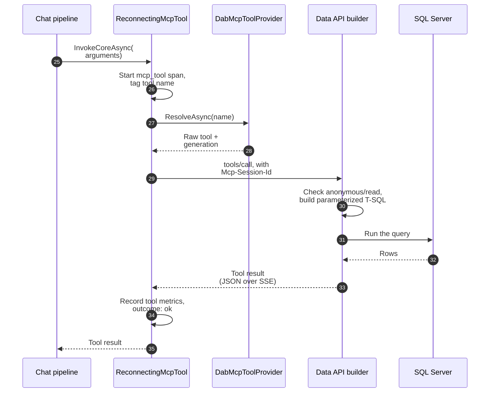

This is the step where SQL appears, and the model had no part in writing it:
DAB turns the tool name and arguments into a parameterized query itself.

A bad argument — an unparseable filter, an unknown column — comes back at
step 33 as an ordinary tool *result*, not an exception, so the model reads the
rejection and can correct itself on the next round.

### Phase 5 — classify, record, release (steps 40–44)

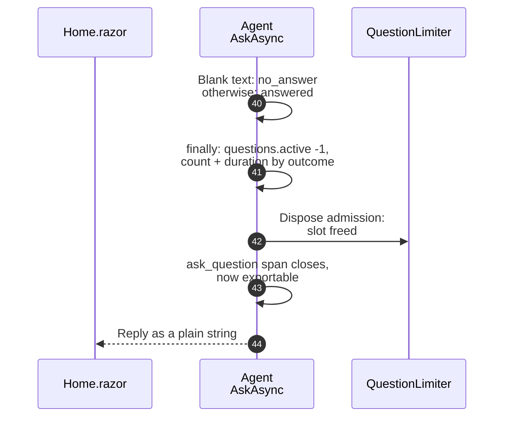

Every return path sets an outcome, and the `finally` block records it, so a
failure that the user sees as a polite sentence is still countable on the
dashboard. Disposing the admission is what frees the slot, which is why it is
held for the whole method.

If `Telemetry:OtlpEndpoint` is set (compose points it at the Aspire Dashboard
on `:18888`), the finished spans and the metrics are exported there. With it
empty, nothing is shipped anywhere.

### Phase 6 — back to the browser (steps 45–48)

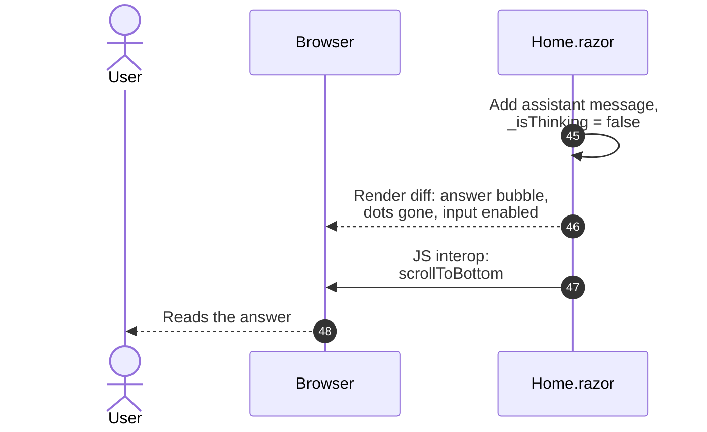

`_isThinking` is reset in a `finally`, so the input box re-enables whatever
`AskAsync` did. If the tab was closed mid-question, `Dispose` has cancelled
`_cts`; the `OperationCanceledException` is caught and the method returns
*without* `StateHasChanged`, because there is no renderer left to call it on.

---

## 3. Every way `AskAsync` can end

Read each diagram top to bottom: a diamond is a check, and each box is
one return path in
[StarTrekAgentService.cs](../src/StarTrekSqlAssistant.Web/Services/StarTrekAgentService.cs),
labelled with the `outcome` tag it records and the gist of what the user reads.

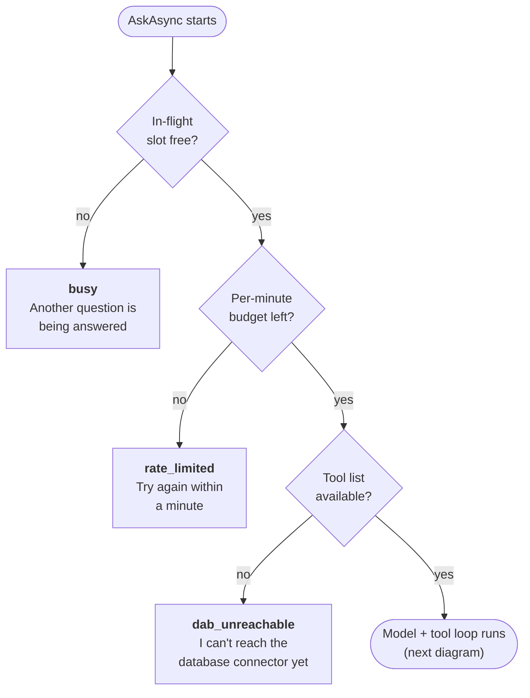

Those three checks happen before the model is involved. Once the tool loop has
run, the result is sorted like this:

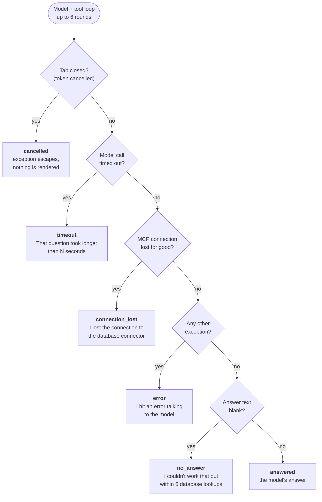

Whichever box a question lands in, the same `Record` helper tags the span with
the outcome and adds to `startrek.questions` and `startrek.question.duration`.

- `busy` and `rate_limited` never incremented `questions.active`, so they skip
  the `finally` block that decrements it.
- `cancelled` is the only path that leaves as an exception rather than a
  string. It is also the default value of `outcome`, which is how the `finally`
  block records it without a `catch` of its own.
- `timeout` is a `TaskCanceledException` while the token is *not* cancelled —
  that is how `HttpClient` reports its own timeout.

---

## 4. One tool call when the connection has died

Phase 4b shows the happy path. This is the same call when the MCP connection
has died — typically because `dab` was restarted to pick up a
`dab-config.json` change. The cached tool list is still a valid object at that
point, so nothing fails until the model actually calls a tool, which is why
the retry lives here and not in `GetToolsAsync`.

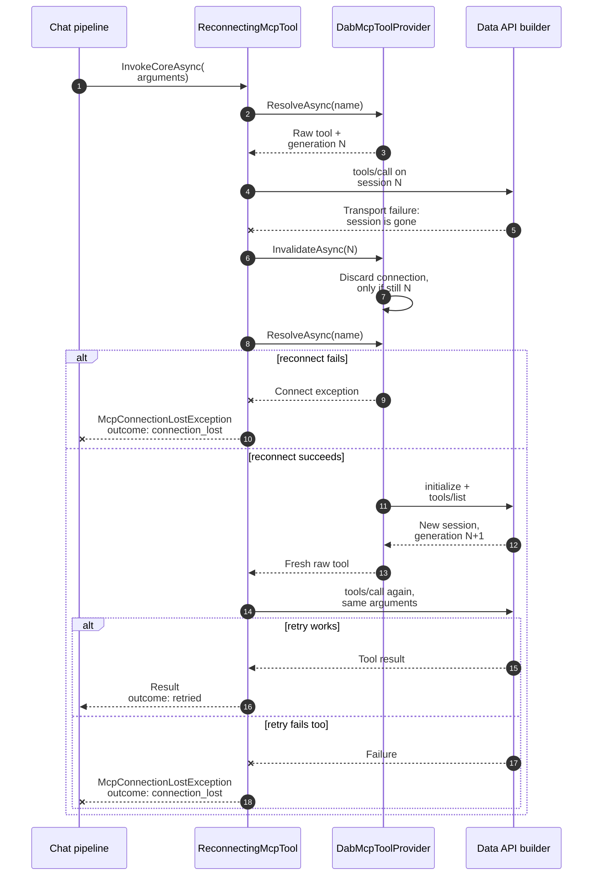

- The **generation number** is what stops two circuits that failed on the same
  dead connection from tearing down each other's replacement: the second
  `InvalidateAsync(N)` finds generation N+1 already in place and does nothing.
- **Any** exception counts as a lost connection. That is safe only because DAB
  reports data problems as ordinary tool *results*.
- The retry happens **once**. `McpConnectionLostException` has its own reply in
  `AskAsync`, so a restarted DAB is not blamed on the model.

---

## 5. What actually crosses each wire

| Hop | Transport | What is sent | What comes back |
| --- | --- | --- | --- |
| Browser → `blazor-app` | SignalR (WebSocket) on the existing circuit | A UI event: form submit or chip click | Render-tree diffs, plus one JS interop call to scroll |
| `Home.razor` → agent | In-process method call | System prompt + last 10 messages, and a cancellation token | A plain string, whether answer or failure |
| Agent → model | HTTP to Ollama on the host (`:11434`), or HTTPS to OpenAI / Anthropic | The conversation and the JSON schema of every tool | Either a tool call or the final text |
| Agent → DAB | MCP over streamable HTTP (`dab:5000/mcp`), with `Mcp-Session-Id` | `tools/call` with the tool name and the model's arguments | The tool result as JSON in an SSE reply |
| DAB → SQL Server | TDS (`sqlserver:1433`) | A parameterized T-SQL query DAB generated itself | Rows |
| `blazor-app` → Aspire Dashboard | OTLP (`:18889`), only when `Telemetry:OtlpEndpoint` is set | Finished spans, metrics, logs | — |

The system prompt (`StarTrekPrompt.SystemPrompt`) rides along on every model
call. It has to: DAB's `describe_entities` returns an empty field list, so the
prompt is where the model learns which entities and columns exist, that titles
are stored in full, and that apostrophes in the data are the curly `’`.
